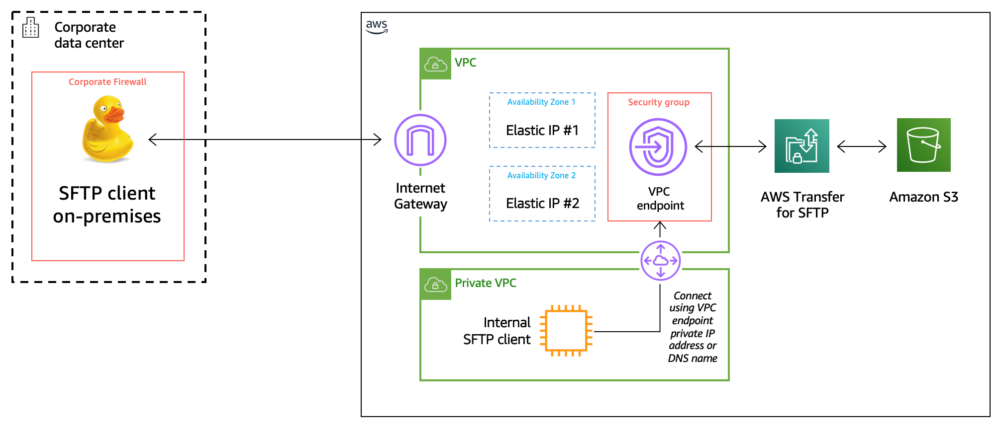

# **AWS Transfer Family**

### Using IP whitelisting to secure your AWS Transfer for SFTP servers

<!--Final rev. for launch Oct 2020-->

© 2020 Amazon Web Services, Inc. and its affiliates. All rights reserved.
This sample code is made available under the MIT-0 license. See the LICENSE file.

Errors or corrections? Contact [russboye@amazon.com](mailto:russboye@amazon.com).

---

## Workshop scenario

In your application workflow, it is necessary to receive files from external entities for exchanging sensitive information such as PHI (Personal Health Information) or financial records. It is critical that these transfers be secure and encrypted.

After doing some research, you have decided to use [AWS Transfer Family](https://aws.amazon.com/transfer) to receive this data from your business partners via SFTP, which will allow this data to flow through an encrypted transport mechanism. In addition, your regulatory and/or Information Security guidelines dictate that only known partners are able to reach the endpoint, and this is controlled through the whitelisting of IPs. Many of your partner entities face similar regulation, and need the ability to control outbound SFTP to a limited list of public IPs.

This workshop will walk you through this scenario, using CloudFormation templates to deploy resources and the AWS Management console to configure those resources accordingly.  As shown in the architecture diagram below, a VPC, two Elastic IPs, an Amazon S3 bucket, and an AWS Transfer for SFTP endpoint will be deployed as a part of this workshop.  

## Prerequisites

#### AWS Account

In order to complete this workshop, you will need an AWS account with rights to create an Amazon VPC, AWS CloudFormation stacks, and Amazon Transfer for SFTP servers in your selected region.

This workshop includes services that are not in the free tier, and may generate charges.  It is recommended that you follow the cleanup instructions once you have completed the workshop to remove all deployed resources and limit ongoing costs to your AWS account.

#### Software

- **Internet Browser**  – It is recommended that you use the latest version of Chrome or Firefox for this workshop.
- **SFTP Client** - You will need an SFTP client for testing

## Workshop Modules

This workshop consists of the following five modules:

- **Module 1** - Complete Setup
- **Module 2** - Test Your Setup with a Basic User
- **Module 3** - Protect Your Data Access with Logical Directories
- **Module 4** - Clean Up
- **Optional Module 5** - Using VPC Peering to Allow Internal IP Access

To get started, go to [Module 1](/module1/README.md).
