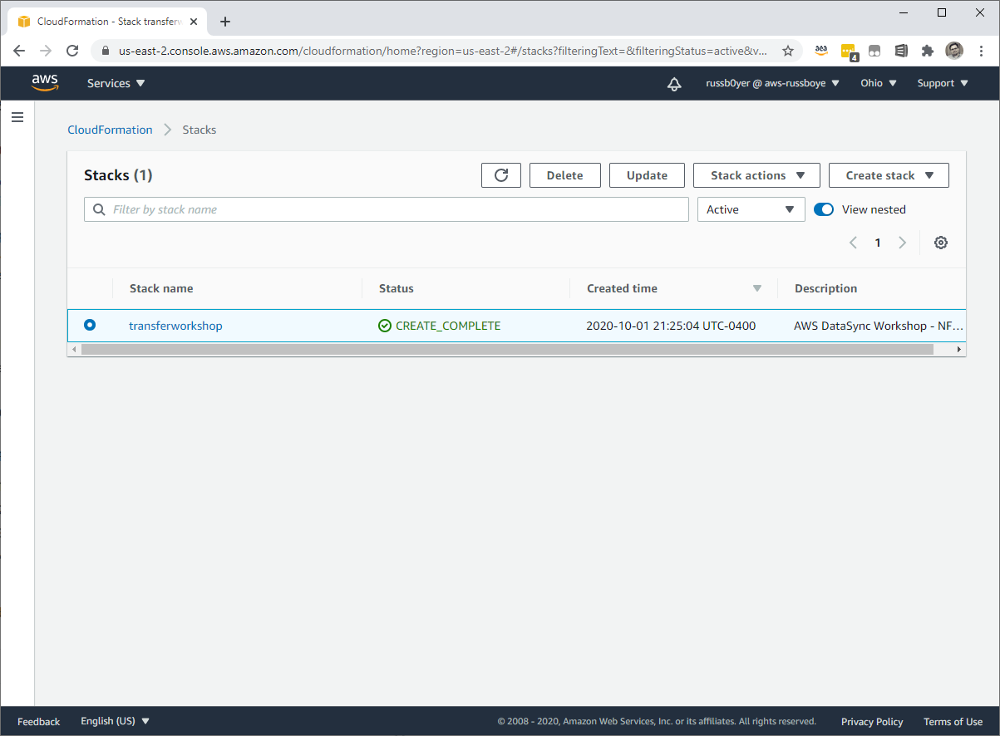
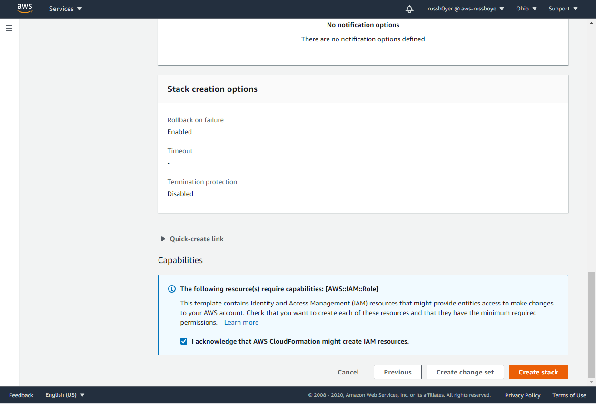
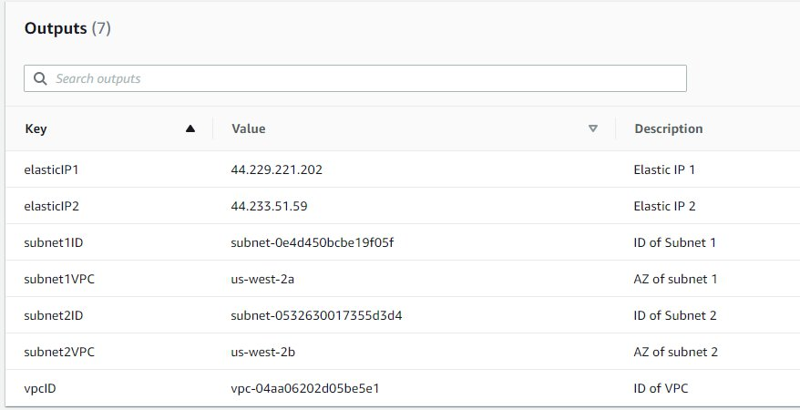
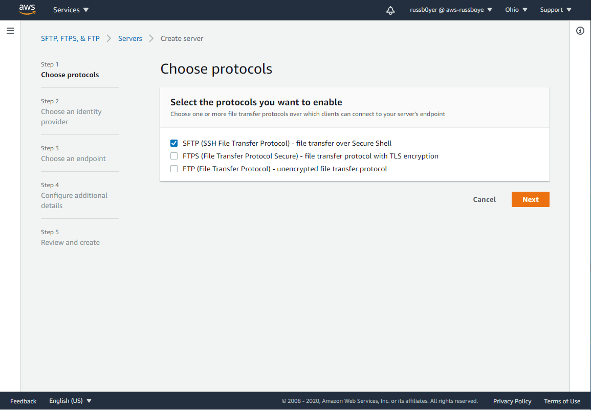
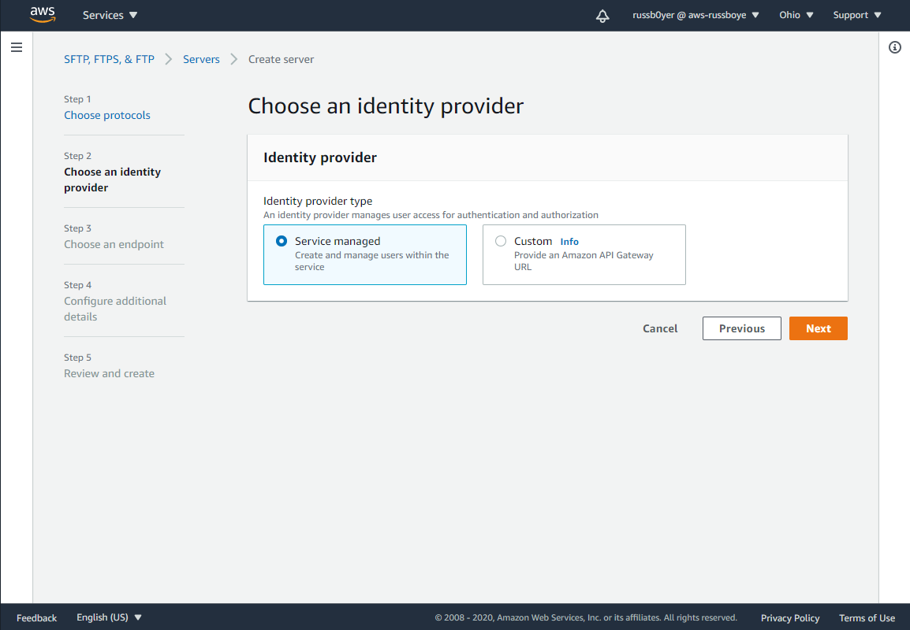
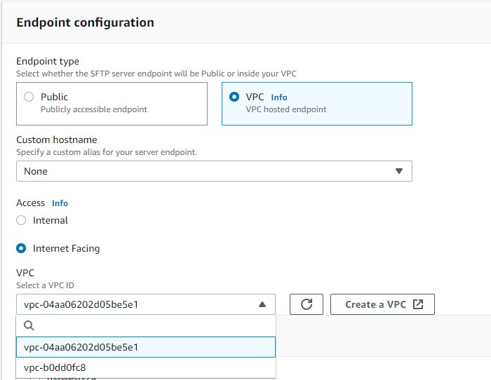
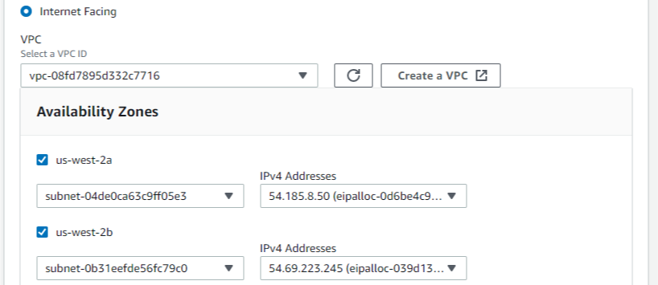
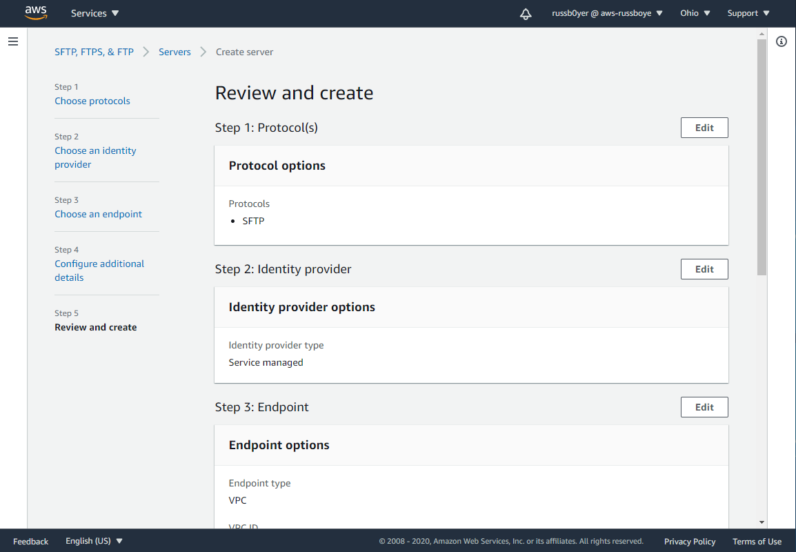
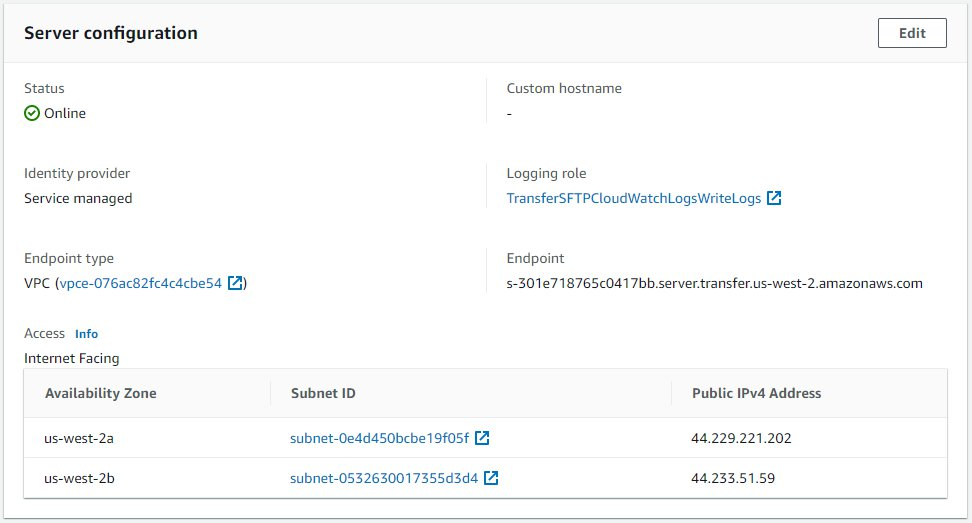

# **AWS Transfer Family**

### Using IP whitelisting and logical directories to secure your AWS Transfer Family servers

© 2020 Amazon Web Services, Inc. and its affiliates. All rights reserved.
This sample code is made available under the MIT-0 license. See the LICENSE file.

Errors or corrections? Contact [russboye@amazon.com](mailto:russboye@amazon.com).

---

# Module 1
## Deploy resources via CloudFormation

In this module, you will use CloudFormation scripts to deploy resources in an AWS region. This CloudFormation template will deploy a new VPC in the chosen region with a private CIDR block, two subnets within that CIDR block, an Internet Gateway for routing public internet traffic, and two Elastic IPs for hosting your AWS SFTP endpoint. Additionally, the cloudformation template will deploy two **Amazon S3** buckets, and three **IAM** roles and policies. 

## Module Steps

#### 1. Deploy AWS resources in your desired region

1. Click one of the launch links in the table below to deploy the required resources using CloudFormation.  To avoid errors during deployment, select a region in which you have previously created AWS resources.

  | **Region Code** | **Region Name** | **Launch** |
  | --- | --- | --- |
  | us-west-1 | US West (N. California) | [Launch in us-west-1](https://console.aws.amazon.com/cloudformation/home?region=us-west-1#/stacks/new?stackName=AWSTransferWorkshopOct2020&templateURL=https://aws-transfer-samples.s3-us-west-2.amazonaws.com/workshops/ip-whitelisting/sftp-workshop-endpoint.yaml) |
  | us-west-2 | US West (Oregon) | [Launch in us-west-2](https://console.aws.amazon.com/cloudformation/home?region=us-west-2#/stacks/new?stackName=AWSTransferWorkshopOct2020&templateURL=https://aws-transfer-samples.s3-us-west-2.amazonaws.com/workshops/ip-whitelisting/sftp-workshop-endpoint.yaml) |
  | us-east-1 | US East (N. Virginia) | [Launch in us-east-1](https://console.aws.amazon.com/cloudformation/home?region=us-east-1#/stacks/new?stackName=AWSTransferWorkshopOct2020&templateURL=https://aws-transfer-samples.s3-us-west-2.amazonaws.com/workshops/ip-whitelisting/sftp-workshop-endpoint.yaml) |
  | us-east-2 | US East (Ohio) | [Launch in us-east-2](https://console.aws.amazon.com/cloudformation/home?region=us-east-2#/stacks/new?stackName=AWSTransferWorkshopOct2020&templateURL=https://aws-transfer-samples.s3-us-west-2.amazonaws.com/workshops/ip-whitelisting/sftp-workshop-endpoint.yaml) |
  | eu-west-1 | Ireland | [Launch in eu-west-1](https://console.aws.amazon.com/cloudformation/home?region=eu-west-1#/stacks/new?stackName=AWSTransferWorkshopOct2020&templateURL=https://aws-transfer-samples.s3-us-west-2.amazonaws.com/workshops/ip-whitelisting/sftp-workshop-endpoint.yaml) |
  | eu-central-1 | Frankfurt | [Launch in eu-central-1](https://console.aws.amazon.com/cloudformation/home?region=eu-central-1#/stacks/new?stackName=AWSTransferWorkshopOct2020&templateURL=https://aws-transfer-samples.s3-us-west-2.amazonaws.com/workshops/ip-whitelisting/sftp-workshop-endpoint.yaml) |

2. Click **Next**  on the **Create Stack** page

3. Click **Next**  on the **Specify stack details** page (there are no stack parameters)
4. Click **Next**  on the **Configure stack options** page (accept all defaults)
5. On the Review page, scroll to the bottom and check the box next to **I Acknowledge...** click  **Create stack**

The template allocates two Elastic IP addresses while creating a VPC, two subnets, and an Internet Gateway. AWS SFTP uses a Multi-AZ architecture to achieve high availability. By creating two subnets and assigning an Elastic IP address to each, your SFTP service is able to withstand the loss of an Availability Zone.

**Note:** While this solution uses Elastic IP addresses, you can also use EC2 BYOIP to import your own static IP addresses.  The BYOIP feature is particularly useful when you are migrating from an existing SFTP server and you would prefer to maintain the same endpoint IP addresses.

Once the AWS CloudFormation stack has been created, you see will see similar output on the outputs tab:

You can see the ID of the VPC, the Availability Zones the subnets were created in, as well as the Elastic IP addresses.  With these resources created, you can now proceed to create your AWS SFTP server.

First, go to the [AWS Transfer Management Console](https://console.aws.amazon.com/transfer/) and choose **Create Server**. On the **Choose protocols** page, choose SFTP, and click **Next**

On the **Choose an identity provider** page, choose **Service managed** and click **Next**

Under **Endpoint Configuration**, select **VPC hosted** for a VPC hosted endpoint. In this exercise, you are creating an Internet Facing server, so select that option. From the VPC drop-down menu, select the VPC with the ID you noted from the outputs of your AWS CloudFormation template. Optionally, you can assign a **Custom hostname** that can be used by your clients to connect to your endpoint. In this example, we will use the service supplied hostname (details in the next section on how this relates to your Elastic IPs). 

Once you have selected your VPC, you see the **Availability Zones** you may choose include the ones your AWS CloudFormation template selected to create your subnets. Select each of those, then select your
**subnet ID** in the left drop-down menu and one of your **Elastic IPs** in the right drop-down menu for each Availability Zone:

**Note:** The service lets you choose up to three **Availability Zones** and it is recommended that you choose more than one **Availability Zone** for HA purposes. In this example, we are using two **Availability Zones**.

On the **Configure additional details** page, leave all the settings at default, and click **Next**

On the **Review and create** page, choose the **Create server** button. 

It takes a few minutes to create your SFTP server. When the creation is complete, and the server status shows as **Online**, select the new server to get more information.

In the preceding screenshot, you can see two key resources that were automatically created by the service.  

First, because you chose to deploy the server in your VPC, a VPC endpoint was automatically created by the service (as shown above under “**Endpoint details**”).  All network traffic to and from the SFTP server passes through this endpoint.  You edit the **Security Group** for this endpoint to whitelist SFTP clients.  

Second, because you chose to make your server internet facing, a DNS name was supplied for your server. This DNS name is the hostname that SFTP clients use to access the server (as shown under “**Endpoint**”). AWS SFTP automatically created an alias record for the DNS name of the form “<serverid>.transfer.<region>.amazonaws.com.” An ANAME record was created that includes the two Elastic IP addresses you assigned to the server.  The service Console provides you the option to assign your custom domain as the hostname your clients can use to access your endpoint using **Route 53 CNAME**.

## Module Summary

In this module, you deployed all of the resources necessary to complete the configuration of a **VPC hosted endpoint** of an **AWS Transfer for SFTP server**.  Next, in **Module 2**, you will be creating a basic user and testing your newly created endpoint.

Go to [Module 2](/module2/README.md).