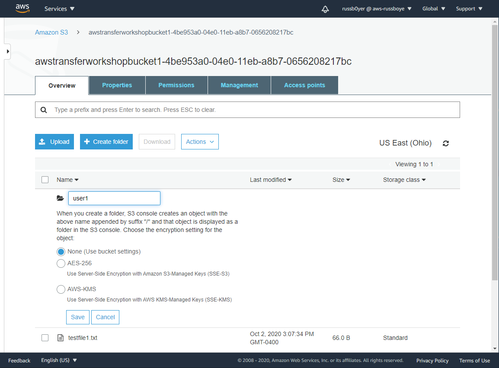
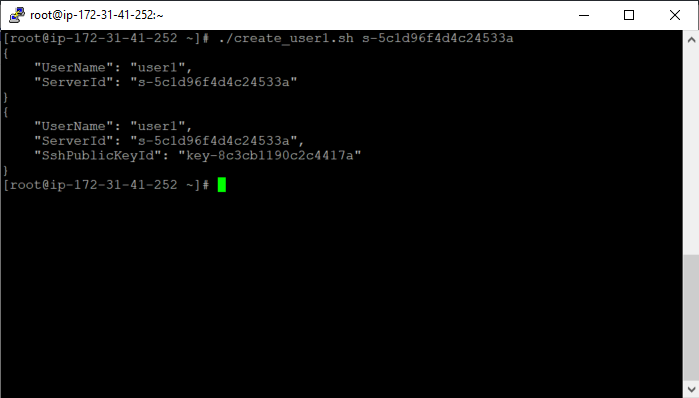
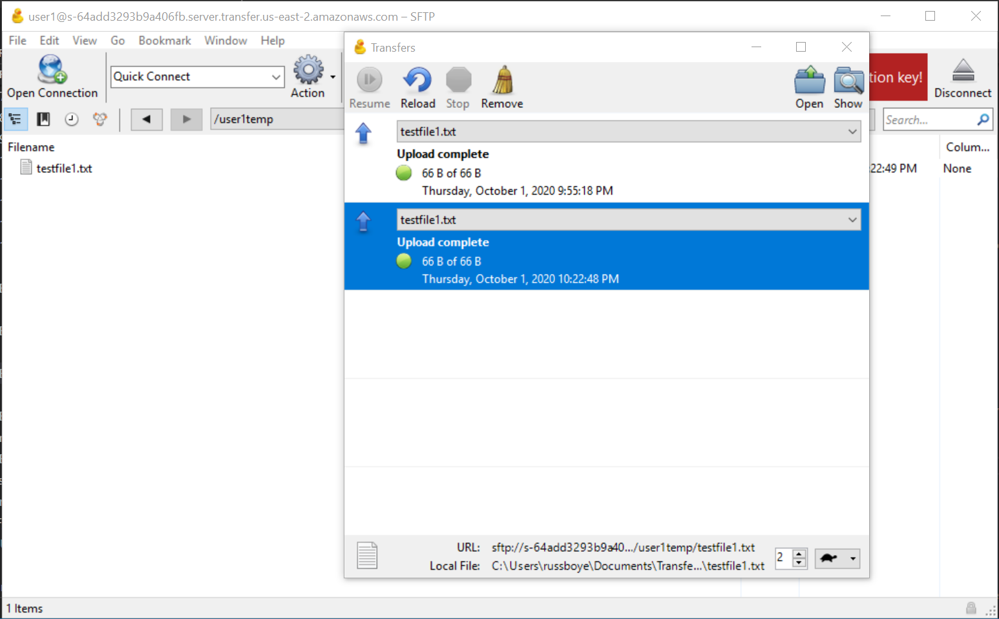
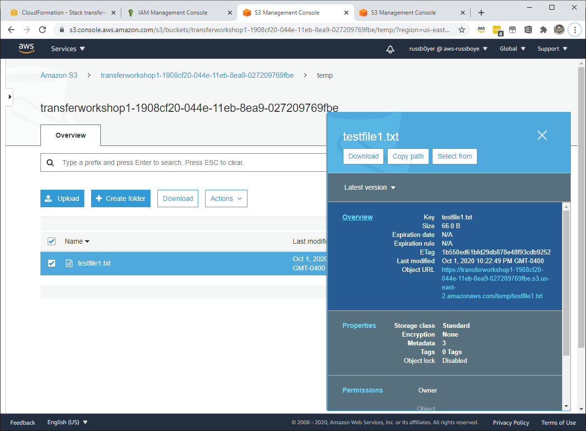
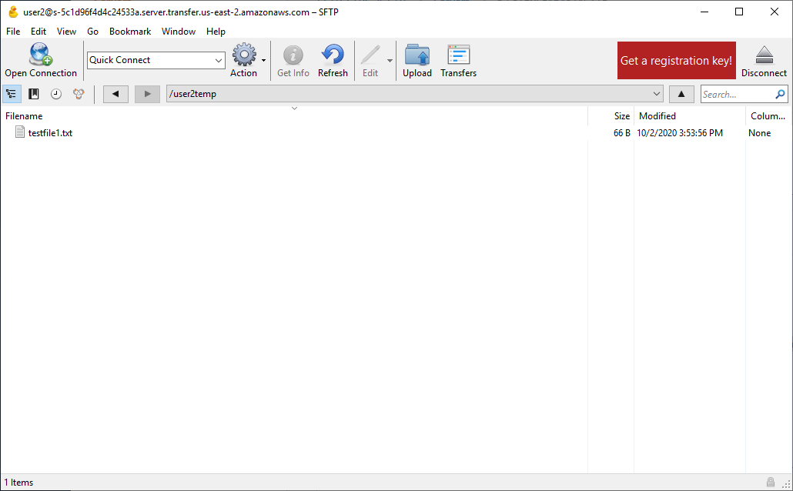
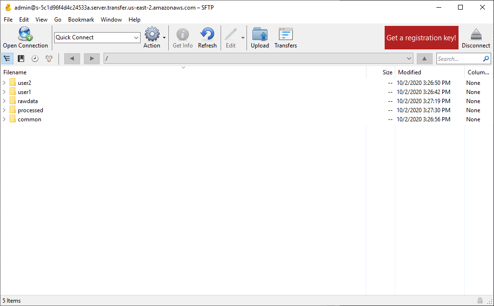

# **AWS Transfer Family**

### Using IP whitelisting and logical directories to secure your AWS Transfer Family servers

© 2020 Amazon Web Services, Inc. and its affiliates. All rights reserved.
This sample code is made available under the MIT-0 license. See the LICENSE file.

Errors or corrections? Contact [russboye@amazon.com](mailto:russboye@amazon.com).

---

<!--Final rev. for launch Oct 2020-->

# Module 3
## Creating organizational users powered by Logical Directories

In this module, you will create a basic set of users to emulate how an organization might manage multiple user access while restricting each user to a specific directory and set of directories. Additionally, we will highlight how to create a user that has access to folders across multiple buckets, in order to ensure additional security and separation. 

## Module Steps

#### Create a User Account

In order to create a Service managed user that has access limited to multiple specific directories, we will need to use the command line. For the purposes of this walk through, we will use a bash script to create each user, and examples will be provided below. Before scripting against the **AWS cli**, It would be a good idea to learn out to use an access key to cache your credentials on the server from which you wish to run your scripts. Follow [this link](https://docs.aws.amazon.com/IAM/latest/UserGuide/id_credentials_access-keys.html) to learn more about **AWS Indentity and Access Management (IAM)** and managing and using access keys.

For the purposes of this workshop, we will be adding users that have access to various **Logical Directories** which map to specific folders in our **Amazon S3** buckets.

The following table lays out the structure we will be building for our organization:

  | **Username** | **Role** | **Bucket 1 Folders** | **Bucket 2 Folders** |
  | --- | --- | --- | --- |
  | user1 | External End User | /user1, /common | --- |
  | user2 | External End User | /user2, /common | --- |
  | regulator | External Super User | --- | /rawdata, /processed |
  | admin | Internal Super User | /user1, /user2, /common | /rawdata, /processed |
  

Before we create the user accounts, we should create the directories listed in the table above inside of **Amazon S3** buckets. From the **Amazon S3** console, click on *awstransferworkshopbucket1*, and inside the bucket click **Create folder**. Supply the folder name for each folder in each bucket in the table above, and for each one click **Save**

In order to create the user accounts, from the command line of a linux server we can execute the following bash scripts, substituting values from your environment in place of the *variables*. These scripts are designed to use the name of the transfer server as a supplied variable on execution, which can be retrieved from your **AWS Transfer Family** console page

#### For user1

<code>
#! /bin/sh

role_arn=`aws iam list-roles | grep -e "Arn.*AWSTransferWorkshopOct2020-s3Bucket1IamRole-6CA6GL68EO5S" | awk '{print $2}' | sed -e 's/[,"]//g'`
server_id=$1
pub_key=`cat demokey.pub`

mapping_1='Entry=/user1,Target=/awstransferworkshopbucket1-4be953a0-04e0-11eb-a8b7-0656208217bc/user1'
mapping_2='Entry=/user1temp,Target=/awstransferworkshopbucket1-4be953a0-04e0-11eb-a8b7-0656208217bc/common'

aws transfer create-user --user-name user1 --server-id $server_id --role $role_arn --home-directory-type LOGICAL --home-directory-mappings $mapping_1 $mapping_2 --region us-east-2

aws transfer import-ssh-public-key --user-name user1 --server-id $server_id --ssh-public-key-body "$pub_key" --region us-east-2
</code>

You should expect to see some output if the script was successful

#### Test your Connection

Once you’ve created the user1 account, you’re able to connect to your SFTP server using the private key that corresponds with the public key used during user creation. Using the hostname of your SFTP server, try to connect using your preferred SFTP client. As user1, try to upload some files to the subdirectories you see once you log in. 

Also, try viewing those uploads in the **Amazon S3** console. 

#### For user2

<code>
#! /bin/sh

role_arn=`aws iam list-roles | grep -e "Arn.*AWSTransferWorkshopOct2020-s3Bucket1IamRole-6CA6GL68EO5S" | awk '{print $2}' | sed -e 's/[,"]//g'`
server_id=$1
pub_key=`cat demokey.pub`

mapping_1='Entry=/user2,Target=/awstransferworkshopbucket1-4be953a0-04e0-11eb-a8b7-0656208217bc/user2'
mapping_2='Entry=/user2temp,Target=/awstransferworkshopbucket1-4be953a0-04e0-11eb-a8b7-0656208217bc/common'

aws transfer create-user --user-name user2 --server-id $server_id --role $role_arn --home-directory-type LOGICAL --home-directory-mappings $mapping_1 $mapping_2 --region us-east-2

aws transfer import-ssh-public-key --user-name user2 --server-id $server_id --ssh-public-key-body "$pub_key" --region us-east-2
</code>

#### Test your Connection

Once you’ve created the user2 account, continue to test between each user, experimenting with what directories can be viewed and accessed on login. An important here is that the folder /common in the first bucket is common across both users, but the **Logical Directory** for each maps to a different folder name. This allows us to obscure the real name of the folder from the user logging in. In this case, this folder represents an area where different users downstream can share files with each other, without having direct **Amazon S3** Bucket access, or needing the ability to edit permissions.

#### For regulator

The code for creating the regulator access is slightly different, since both folders the regulator needs access to are in the 2nd bucket.

<code>
#! /bin/sh

role_arn=`aws iam list-roles | grep -e "Arn.*AWSTransferWorkshopOct2020-s3Bucket2IamRole-1GEPCONZOVSF" | awk '{print $2}' | sed -e 's/[,"]//g'`
server_id=$1
pub_key=`cat demokey.pub`

mapping_1='Entry=/rawdata,Target=/awstransferworkshopbucket2-4be953a0-04e0-11eb-a8b7-0656208217bc/rawdata'
mapping_2='Entry=/processed,Target=/awstransferworkshopbucket2-4be953a0-04e0-11eb-a8b7-0656208217bc/processed'

aws transfer create-user --user-name regulator --server-id $server_id --role $role_arn --home-directory-type LOGICAL --home-directory-mappings $mapping_1 $mapping_2 --region us-east-2

aws transfer import-ssh-public-key --user-name regulator --server-id $server_id --ssh-public-key-body "$pub_key" --region us-east-2
</code>

#### Test your Connection

Once you’ve created the regulator account, continue to test between each user, experimenting with what directories can be viewed and accessed on login.

#### For admin

The code for creating the admin account for full access is again different, but in this section special attention should be given to a couple of things:

1. This user has access to folders in both buckets, and will need a role that allows for this access. 
2. This user has full access to all folders, and needs several more mappings parameters. 

<code>
#! /bin/sh

role_arn=`aws iam list-roles | grep -e "Arn.*AWSTransferWorkshopOct2020-s3BucketallIamRole-17L5BZ9RNZNO1" | awk '{print $2}' | sed -e 's/[,"]//g'`
server_id=$1
pub_key=`cat demokey.pub`

mapping_1='Entry=/user1,Target=/awstransferworkshopbucket1-4be953a0-04e0-11eb-a8b7-0656208217bc/user1'
mapping_2='Entry=/user2,Target=/awstransferworkshopbucket1-4be953a0-04e0-11eb-a8b7-0656208217bc/user2'
mapping_3='Entry=/common,Target=/awstransferworkshopbucket1-4be953a0-04e0-11eb-a8b7-0656208217bc/common'
mapping_4='Entry=/rawdata,Target=/awstransferworkshopbucket2-4be953a0-04e0-11eb-a8b7-0656208217bc/rawdata'
mapping_5='Entry=/processed,Target=/awstransferworkshopbucket2-4be953a0-04e0-11eb-a8b7-0656208217bc/processed'

aws transfer create-user --user-name admin --server-id $server_id --role $role_arn --home-directory-type LOGICAL --home-directory-mappings $mapping_1 $mapping_2 $mapping_3 $mapping_4 $mapping_5 --region us-east-2

aws transfer import-ssh-public-key --user-name admin --server-id $server_id --ssh-public-key-body "$pub_key" --region us-east-2
</code>

#### Test your Connection

Once you’ve created the admin account, continue to test between each user, experimenting with what directories can be viewed and accessed on login. This user represents a super user, and as such has access to all the directories. Additionally, this demonstrates the concept of spanning **Logical Directories** across multiple **Amazon S3** buckets.

## Module Summary

In this module, you created several users to represent some common organizational structures encountered in real world workloads. This should give you a good idea of how to control user access across multiple folders, which may be common amongst some users, as well as multiple buckets. As you walked through creating these users, hopefully you observed how easy it is to create a fully managed **AWS Transfer Family** server.

In the next module, we will be cleaning up after today's workshop.

Go to [Module 4](/module4/README.md).
