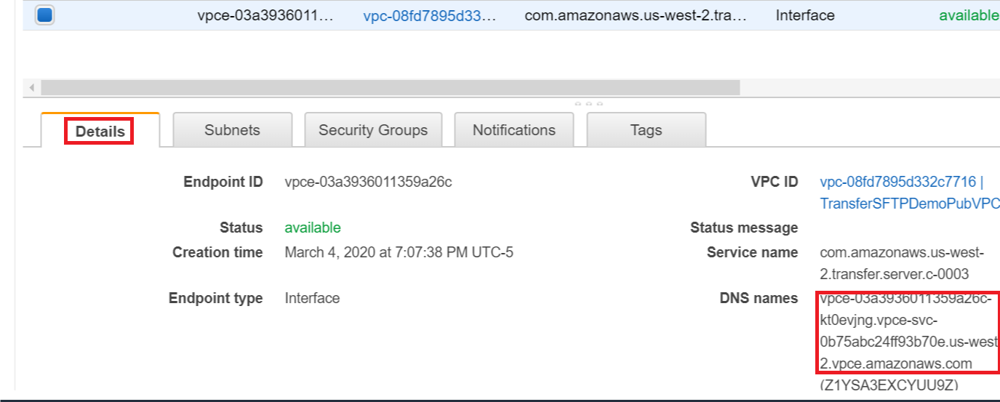
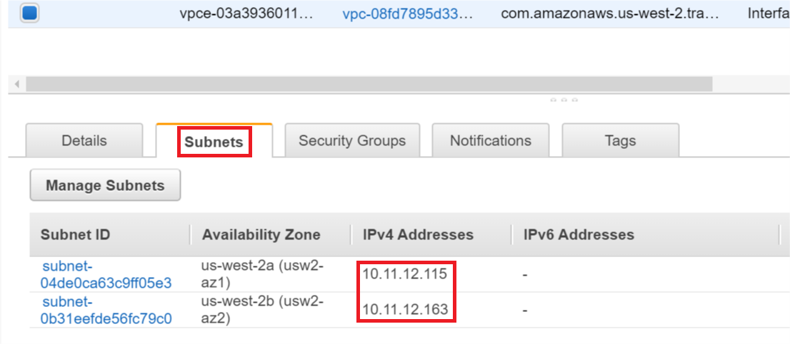

# **AWS Transfer for SFTP**

### Using IP whitelisting to secure your AWS Transfer for SFTP servers

© 2020 Amazon Web Services, Inc. and its affiliates. All rights reserved.
This sample code is made available under the MIT-0 license. See the LICENSE file.

Errors or corrections? Contact [russboye@amazon.com](mailto:russboye@amazon.com).

---

<!--Final rev. for launch Oct 2020-->

# Optional Module 5
## Optional setup for private VPC access

In this module, you may also want to allow traffic from clients in the same VPC, other VPCs (via Peering), or on-premises environments (via Direct Connect/VPN) to reach your SFTP server endpoint without traversing public IP space. In some cases, certain VPCs may not even be allowed to pass traffic to the internet and may lack a NAT Gateway or Internet Gateway. In these use cases, clients can access the server’s endpoint using the endpoint’s private IP addresses.

## Module Steps

You may obtain these private addresses and their associated DNS names by reviewing the **Details** and **Subnets** tabs of your SFTP server endpoint in the endpoints area of the VPC console.

**Details** tab screenshot:

**Subnets** tab screenshot:

#### 1. Establish a VPC peering session

In order to allow traffic from other VPCs to reach your SFTP server, you want to [establish a VPC peering session](https://docs.aws.amazon.com/vpc/latest/peering/create-vpc-peering-connection.html). A VPC peering session is not limited to VPCs within a single account, and also might be used to provide direct access to other accounts or partner organizations. Once the VPC peering session is established, appropriate [routes must be added](https://docs.aws.amazon.com/vpc/latest/peering/vpc-peering-routing.html) in order to allow subnets within those VPCs to reach each other. The final step to allow traffic originating from the peer VPC to reach your SFTP server endpoint is to whitelist either specific IPs or ranges to your Security Group. See the test procedure in the next Module for an example of adding whitelisted IPs.

## Module Summary

In this module, you established a peering session with another **VPC**, and Added the appropriate routes for your **AWS Transfer for SFTP** server's endpoint to be available to this peered VPC without traversing public IP space.

In the next module, you will test your **AWS Transfer for SFTP** endpoint whitelisting capability.

Go to [Module 3](/module3/README.md).
